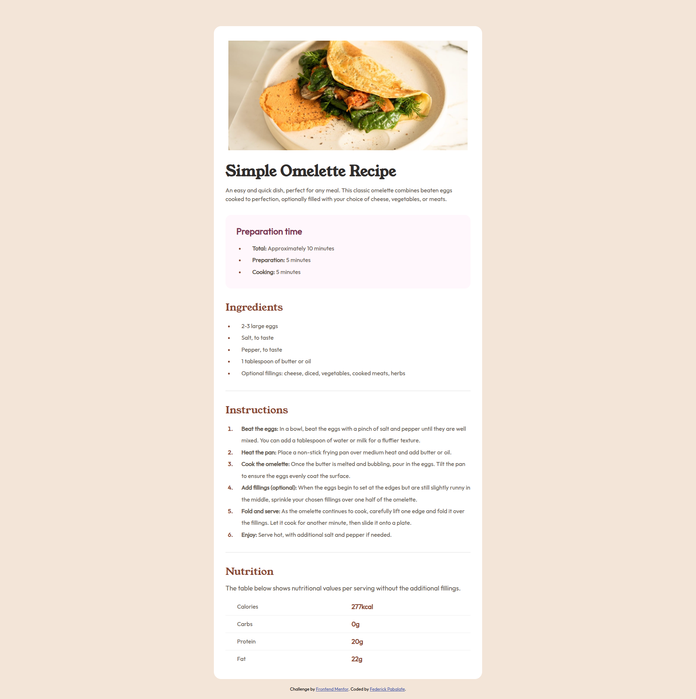

# Frontend Mentor - Recipe page solution

This is a solution to the [Recipe page challenge on Frontend Mentor](https://www.frontendmentor.io/challenges/recipe-page-KiTsR8QQKm). Frontend Mentor challenges help you improve your coding skills by building realistic projects.

## Table of contents

- [Overview](#overview)
  - [The challenge](#the-challenge)
  - [Screenshot](#screenshot)
  - [Links](#links)
- [My process](#my-process)
  - [Built with](#built-with)
  - [What I learned](#what-i-learned)
  - [Continued development](#continued-development)
  - [Useful resources](#useful-resources)
- [Author](#author)

## Overview

### Screenshot



### Links

- Solution URL: [https://www.frontendmentor.io/solutions/responsive-recipe-page-zV7emPVrH3](https://www.frontendmentor.io/solutions/responsive-recipe-page-zV7emPVrH3)
- Live Site URL: [https://federick-pabalate.github.io/frontendmentor-recipe-page/](https://federick-pabalate.github.io/frontendmentor-recipe-page/)

## My process

### Built with

- Semantic HTML5 markup
- CSS custom properties
- Flexbox
- CSS Grid
- Mobile-first workflow

### What I learned

In this it helps me to write more semantic HTML and appropriate placement of the content within the page.

Code snippets:

In this section of code I found this css pseudo class :first-child and :last-child to target element within a certain container

```css
.card__nutrition table td:first-child {
  color: var(--text-color-stone-600);
  padding-left: 32px;
}

.card__nutrition table td:last-child {
  color: var(--text-color-secondary);
  font-weight: 900;
  font-size: var(--fs-base);
  padding-right: 32px;
}
```

In this section of code I found this css pseudo class :marker. It helps me to target those bullets and numbers within a list

```css
.card__ingredients ul li::marker,
.card__preparation-time ul li::marker,
.card__instructions ol li::marker {
  color: var(--text-color-secondary);
}
```

### Continued development

Use this section to outline areas that you want to continue focusing on in future projects. These could be concepts you're still not completely comfortable with or techniques you found useful that you want to refine and perfect.

In my upcoming projects, I will use fundamental HTML and CSS with proper semantics, making my code easier for other developers to read and understand.

**Note: Delete this note and the content within this section and replace with your own plans for continued development.**

### Useful resources

- [CSS :first-child pseudo-class ](https://developer.mozilla.org/en-US/docs/Web/CSS/Reference/Selectors/:first-child) - It's very informative documentation. It helped me to achieve selection of first data in the table row.

- [CSS :last-child pseudo-class ](https://developer.mozilla.org/en-US/docs/Web/CSS/Reference/Selectors/:last-child) - Almost the same for first but this selection targets the last data in the table row.

- [CSS :marker pseudo-class ](https://developer.mozilla.org/en-US/docs/Web/CSS/Reference/Selectors/:last-child) - It helps me solve to select marker box of a list item which typically contains bullet or number.

## Author

- Frontend Mentor - [https://www.frontendmentor.io/profile/federick-pabalate](https://www.frontendmentor.io/profile/federick-pabalate)
- Github - [https://github.com/federick-pabalate](https://github.com/federick-pabalate)
